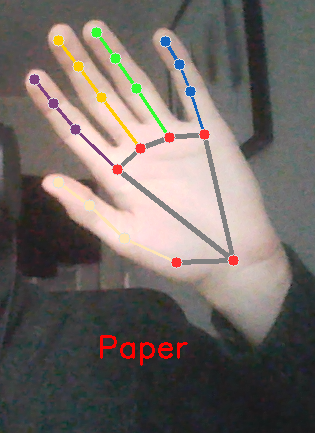
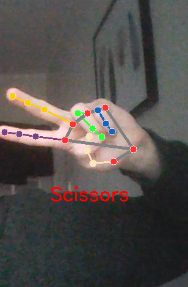
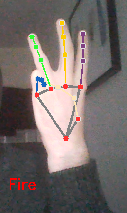
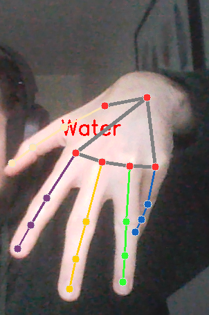
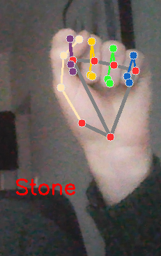

Authors: Mariusz Krzyzopolski s21544 Tomasz Baj s20499

Please run main.py file with opencv-python and mediapipe installed.

That module is responsible for detecting the hand gesture for popular game, rock - paper- scissors. There is a little twist in our game:
that is a Fire and Water gesture. To make Fire you need to show 3 straight fingers, without thumb and little finger.
For water you need to make gesture similar to paper, but fingers should be directed downwards

Examples:

## paper

## Scissors

## Fire

## Water

## Stone

